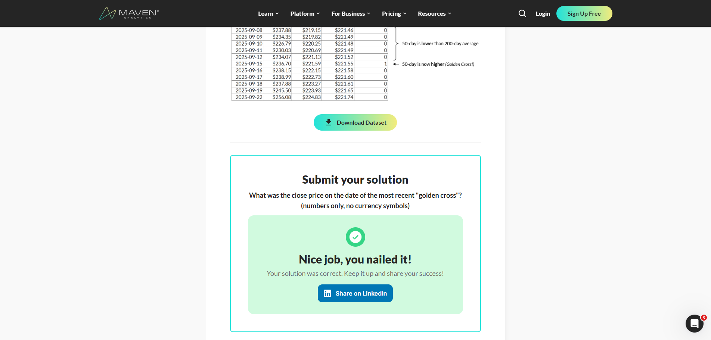

 Financial Analysis Project: SPY Moving Average Analysis

 Overview
  
 
 
 

This project analyzes the SPDR S&P 500 ETF Trust (SPY) using technical analysis techniques. It calculates 50-day and 200-day Simple Moving Averages (SMA) over a 5-year period and identifies "Golden Cross" signals—moments when the 50-day average crosses above the 200-day average, indicating potential bull market conditions.

 Objectives

- Calculate 50-day and 200-day moving averages for SPY closing prices
- Identify Golden Cross events with precision
- Compare multiple data tools (SQL, Python, Excel, Power BI) for the same analysis workflow
- Generate comprehensive output with date, close price, and technical indicators

 Directory Structure

```
├── 01_Data/                               Raw data files
│   └── SPY_close_price_5Y.csv            SPY historical closing prices (5 years)
├── 02_Scripts/                            Data processing scripts
│   ├── 01_calculate_sma.sql              SQL implementation
│   ├── 02_sma_pipeline.py                Python implementation
│   └── 03_calculate close price...       Golden Cross calculation
├── 03_Output/                             Generated outputs
│   └── spy_sma_calculated.csv            Results with moving averages and signals
└── 04_Docs/                               Project documentation
```

 Data Fields

The output dataset includes:
- Date: Trading date
- Close Price: SPY closing price for that date
- 50-Day SMA: Simple moving average of closing prices over last 50 trading days
- 200-Day SMA: Simple moving average of closing prices over last 200 trading days
- Golden Cross: Binary flag (1/0) indicating the exact date when 50-day SMA crosses above 200-day SMA

 Key Findings

- Latest Data Point (Oct 31, 2025): SPY closed at $682.06, well above the 50-day SMA of $662.17
- Tooling Assessment: Python demonstrated superior versatility for the complete ETL + Analysis workflow
- Multiple Implementations: SQL and Python scripts available for different use cases

 Getting Started

 Prerequisites
- Python 3.7+
- Required packages: `pandas`, `matplotlib`

 Running the Analysis (Python)

1. Install dependencies:
   ```bash
   pip install pandas matplotlib
   ```

2. Navigate to the scripts directory:
   ```bash
   cd 02_Scripts
   ```

3. Execute the pipeline:
   ```bash
   python 02_sma_pipeline.py
   ```

4. Find results in `03_Output/spy_sma_calculated.csv`

 Running the Analysis (SQL)
See `02_Scripts/01_calculate_sma.sql` for SQL-based implementation and `03_calculate close price...` for Golden Cross calculation.

 Author & Date

Created: December 31, 2025
