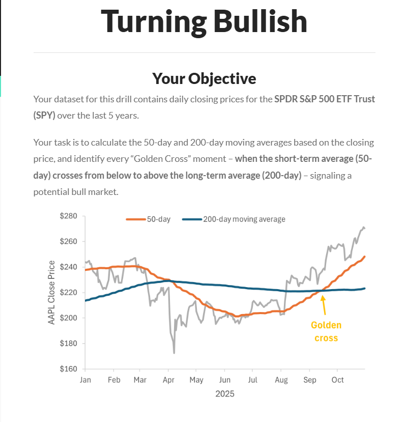

 Financial Analysis Project: SPY 50-Day SMA
Your dataset for this drill contains daily closing prices for the SPDR S&P 500 ETF Trust (SPY) over the last 5 years.
Your task is to calculate the 50-day and 200-day moving averages based on the closing price, and identify every “Golden Cross” moment – when the short-term average (50-day) crosses from below to above the long-term average (200-day) – signaling a potential bull market.
To complete the drill, create a table containing the date, close price, and three new columns:

50-day moving average: The average closing price for the last 50 trading days, calculated for each date

200-day moving average: The average closing price for the last 200 trading days, calculated for each date

Golden Cross: A binary field (1/0) that equals 1 only on the exact date when the 50-day average crosses from below the 200-day average; otherwise 0

 
 
 

 1. Project Overview
This project benchmarks four major data tools (Excel, SQL, Python, Power BI) by performing a standard technical analysis task: calculating the 50-Day Simple Moving Average (SMA) for the S&P 500 (SPY).

 2. Directory Structure
 01_Data/: Contains `SPY_close_price_5Y.csv`.
 02_Scripts/: Contains `02_sma_pipeline.py` (Python) and `01_calculate_sma.sql` (SQL).
 03_Output/: Contains the generated `spy_sma_chart.png` and `spy_sma_calculated.csv` and '50 Day SMA.pbix'.
 04_Docs/: Project documentation.

 3. Findings
 Trend: As of Oct 31, 2025, SPY Closed at $682.06, well above the 50-day SMA of $662.17.
 Tooling: Python was identified as the most versatile tool for this ETL + Analysis workflow.

 4. How to Run (Python)
1.  Ensure you have Python installed.
2.  Install dependencies: `pip install pandas matplotlib`
3.  Navigate to `02_Scripts`.
4.  Run: `python 02_sma_pipeline.py`